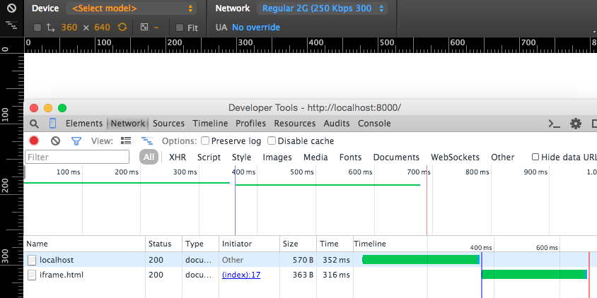

# iframe-not-rendering
Minimal test case for iframe not rendering (Chrome bug
https://code.google.com/p/chromium/issues/detail?id=481922). Repro'd on Chrome
43.0.2357.130 Mac and Windows.

Seems like higher network latencies is required (e.g. 450Kbps, RTT >= 150ms).
Use network throttling to achieve this with Chrome Dev Tools.

Screenshot:

Assuming server on port 8000 visit: http://localhost:8000/

Expected: iframe with text inside (screenshot below)

Actual: iframe not rendered (shows as white)

Forcing repaint (in this case resizing browser window width) shows the text.
